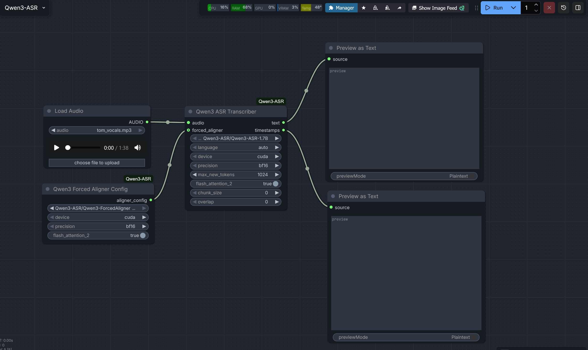

# ComfyUI Qwen3 ASR

A high-performance ComfyUI integration for the **Qwen3-ASR** model family. This extension provides state-of-the-art speech-to-text transcription, language identification, and precise word-level timestamps using the novel Qwen3 Forced Aligner.

[](https://github.com/QwenLM/Qwen3-ASR)
[](https://github.com/kaushiknishchay/ComfyUI-Qwen3-ASR/blob/main/LICENSE.md)

## Documentation
- [Qwen3 ASR Transcriber](transcriber.md)
- [Qwen3 Forced Aligner Config](forced_aligner.md)

## Features
- **High Accuracy**: Supports Qwen3-ASR 0.6B and 1.7B models.
- **Multilingual**: Supports 52 languages and dialects with automatic language detection.
- **Word-Level Timestamps**: Optional integration with Qwen3-ForcedAligner-0.6B.
- **Flexible Precision**: Support for `bf16`, `fp16`, and `fp32` to balance VRAM and speed.
- **Automatic Resampling**: Internally handles audio resampling to 16kHz for optimal model performance.
- **FlashAttention 2**: Integrated support for FlashAttention 2 to significantly reduce VRAM usage and accelerate inference.

## Preview



## Installation

### Manual Installation


1. Navigate to your ComfyUI `custom_nodes` directory:
   ```bash
   cd ComfyUI/custom_nodes
   ```
2. Clone this repository:
   ```bash
   git clone https://github.com/kaushiknishchay/ComfyUI-Qwen3-ASR
   ```
3. Install the dependencies using your ComfyUI Python executable:
   ```bash
   # For portable versions, use the full path to your python.exe
   python.exe -m pip install -r ComfyUI-Qwen3-ASR/requirements.txt
   ```
4. **(Recommended)** Install FlashAttention 2 for maximum performance:
   ```bash
   # For FlashAttention 2 (requires compatible NVIDIA GPU)
   python.exe -m pip install -U flash-attn --no-build-isolation
   ```

   OR

### Install via ComfyUI Manager
- Search `ComfyUI-Qwen3-ASR` by `Kaushik`

## Model Setup

Models must be placed in the `models/diffusion_models/Qwen3-ASR/` directory. Each model should be in its own subfolder containing the full weights and configuration.

### Recommended Directory Structure:
```
ComfyUI/models/diffusion_models/Qwen3-ASR/
├── Qwen3-ASR-1.7B/
│   ├── config.json
│   ├── model.safetensors
│   └── ...
├── Qwen3-ASR-0.6B/
│   └── ...
└── Qwen3-ForcedAligner-0.6B/
    └── ...
```

### Downloading Models
You can use the `huggingface-cli` to download the models directly into the correct folders:
```bash
huggingface-cli download Qwen/Qwen3-ASR-1.7B --local-dir models/diffusion_models/Qwen3-ASR/Qwen3-ASR-1.7B
huggingface-cli download Qwen/Qwen3-ForcedAligner-0.6B --local-dir models/diffusion_models/Qwen3-ASR/Qwen3-ForcedAligner-0.6B
```

## Troubleshooting

- **Python 3.13 Issues**: If you encounter an `UnboundLocalError` related to `lazy_loader`, ensure you have updated the package:
  ```bash
  python.exe -m pip install -U lazy-loader
  ```
- **VRAM Usage**: The 1.7B model requires approximately 4-6GB of VRAM in `bf16` mode. If you run out of memory, try the 0.6B model or use `cpu` mode.

## License
This project is licensed under the MIT License. The Qwen3 models are subject to the Qwen License Agreement.
